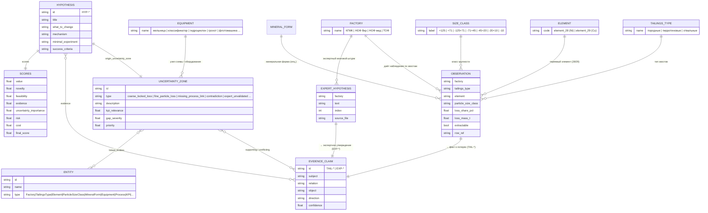

# Онтология предметной области (ER-диаграмма)

Модель данных «Фабрики гипотез»: от фабрики и её хвостов до зон
неопределённости и гипотез. Соответствует типам в
`hypothesis_factory/models.py` и загрузчику `real_case_loader.py`.

## Ключевые связи

- **Фабрика → наблюдения**: каждая из 4 фабрик даёт строки по хвостам; строка
  разворачивается в наблюдения по элементу 28 и 29 (всего 230).
- **Наблюдение → факт**: числовые потери превращаются в `EvidenceClaim`
  `TAIL-*` (94 шт.); экспертные идеи — в `EXP-*` (27 шт.).
- **Зона неопределённости** связывает сущности (фабрика, класс, элемент,
  оборудование) и опирается на факты; всего 28 зон 4 типов.
- **Гипотеза** порождается ровно из одной зоны (`origin_uncertainty_zone`),
  цитирует факты как evidence и несёт вектор оценок `SCORES`.
