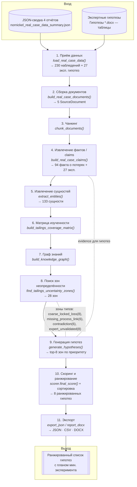

# Сквозной pipeline «Фабрики гипотез» (BPMN)

Диаграмма описывает 11 шагов реального (real-case) конвейера
`hypothesis_factory.pipeline._run_real_case_pipeline`. В скобках указаны
функция/модуль и объём артефакта на дефолтном KPI (снижение потерь
элемента 28 / элемента 29).

## Пояснения к шагам

| # | Шаг | Модуль | Что делает |
|---|-----|--------|-----------|
| 1 | Приём данных | `data_loaders/real_case_loader.py`, `hypotheses_docx_parser.py` | Читает JSON-сводку хвостов (4 фабрики) и парсит экспертные гипотезы из таблиц `.docx`. |
| 2 | Сборка документов | `real_case_loader.build_real_case_documents` | Собирает 5 текстовых документов (база знаний + по фабрике + экспертный). |
| 3 | Чанкинг | `ingestion/chunking.py` | Режет документы на чанки для последующего анализа/поиска. |
| 4 | Факты / claims | `real_case_loader.build_real_case_claims` | 94 факта о потерях по классам + 27 экспертных утверждений → `EvidenceClaim`. |
| 5 | Сущности | `extraction/entity_extractor.py` | Правиловое извлечение сущностей (фабрика, класс, элемент, оборудование…). |
| 6 | Матрица изученности | `analysis/tailings_analyzer.build_tailings_coverage_matrix` | Покрытие «фабрика×тип×элемент×класс», статус (well/weakly/uncovered). |
| 7 | Граф знаний | `graph/graph_builder.py` | Строит граф из claims для связей и косвенных путей. |
| 8 | Зоны неопределённости | `analysis/tailings_analyzer.find_tailings_uncertainty_zones` | Формирует и приоритизирует 28 зон 4 типов. Приоритет = `0.5·kpi + 0.35·gap + 0.15·max(contradiction,indirect)`. |
| 9 | Генерация гипотез | `generation/hypothesis_generator.py` | Из top-8 зон строит проверяемые гипотезы (что менять, механизм, мин. эксперимент). |
| 10 | Скоринг / ранжирование | `scoring/scorer.py`, `scoring/profiles.py` | Взвешенная оценка value/novelty/feasibility/evidence/uncertainty − risk − cost, сортировка. |
| 11 | Экспорт | `export/export_json.py`, `export/report_docx.py` | Выгрузка результата в JSON / CSV / DOCX. |

> Генерация детерминированная, без LLM (`generation/llm_client.py` — заглушка-хук).
